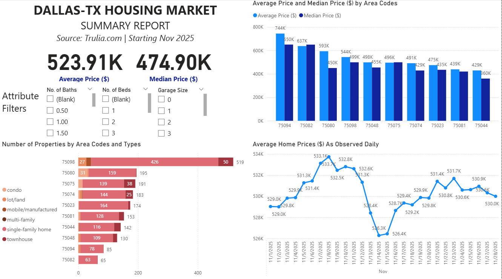

# Dallas-TX Housing Market Analysis
### This project is an end-to-end analysis of housing market data collected from [Trulia.com](https://www.trulia.com/). The data scope includes properties listed for sale in these ten postal area codes: 75044, 75080, 75081, 75082, 75094, 75074, 75048, 75098, 75075, and 75023. The dataset is curated entirely from an ELT pipeline, and is used to drive analyses and insights performed with Excel and Power BI

## Pipeline Operation Procedure
- `main_extract.py` performs data scraping from property listing webpages on Julia.com to retrieve the property data (price, property attributes, market status). Records from the same postal area are grouped together, and data of each area is stored in a separate JSON file. These JSON files are then persisted into an intermediary [MinIO](https://www.min.io/) object store
- `main_load.py` reads all JSON files from the object store, combines all data records together, and loads them into a raw data table inside a [ClickHouse](https://clickhouse.com/) database
- The raw data inside ClickHouse goes through transformations performed with [dbt](https://www.getdbt.com/). The data is organized into three layers: raw, staging, and mart:
    - Raw data is loaded directly from the object store into the database without any modifications
    - Staging data is raw data after fields have been necessarily transformed for later easier analysis. Also in this step, the one raw data table is splitted into a fact table holding frequently-changing fields like price, and a dimension table holding housing property attribute data like year built, bedroom count, bathroom count, floor area, etc.
    - Moving from staging to mart layer, newly found data is appended, while existing data is refreshed with more updated versions. This final layer is also where the data is ready for analysis
- `main_orchestrate.py` holds the definition of the [Airflow](https://airflow.apache.org/) DAG used to schedule the pipeline automation. This ELT pipeline is configured to run once on a daily basis, hence establishing day-by-day snapshots of the housing market

## Data Analysis & Visualization
- A market summary report with interactive visualizations was performed in [Housing-Market-Report.pbix](Housing-Market-Report.pbix) using Power BI and its data modeling feature (Please download to use the interactive visualization feature)

- Deep-dive data analyses along with visualizations and filters were performed in [Housing-Market-Analysis](Housing-Market-Analysis.xlsx) using Power Query and PowerPivot with DAX in Microsoft Excel